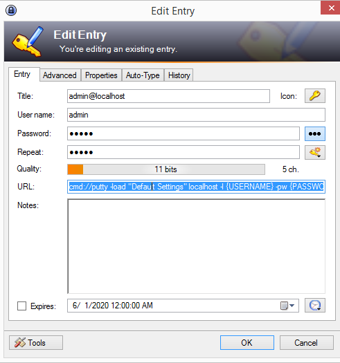

# Spring Boot Embedded SSHD Test Server Example

#### https://mina.apache.org/sshd-project/

#### Start the application by running 

##### (Linux/Mac)

```sh
./mvnw 
```

##### (Windows)

```sh
mvnw 
```

##### Test Connection To An SSH Server;

```sh
$ curl -i -v telnet://localhost:22
* Uses proxy env variable no_proxy == '192.168.1.101'
  % Total    % Received % Xferd  Average Speed   Time    Time     Time  Current
                                 Dload  Upload   Total   Spent    Left  Speed
  0     0    0     0    0     0      0      0 --:--:-- --:--:-- --:--:--     0SSH-2.0-APACHE-SSHD-2.4.0
*   Trying ::1:22...
* Connected to localhost (::1) port 22 (#0)
```

##### Connect To SSH Server (with credentials as admin/admin);

```sh
$ ssh admin@localhost
Password authentication
Password:

```

##### Launch Putty From KeePass Securely

###### Add a new URL entry in KeePass with the following;

```
cmd://putty -load "Default Settings" localhost -l {USERNAME} -pw {PASSWORD}
```




##### Related Video

https://youtu.be/BwJ0kd4zEHc
